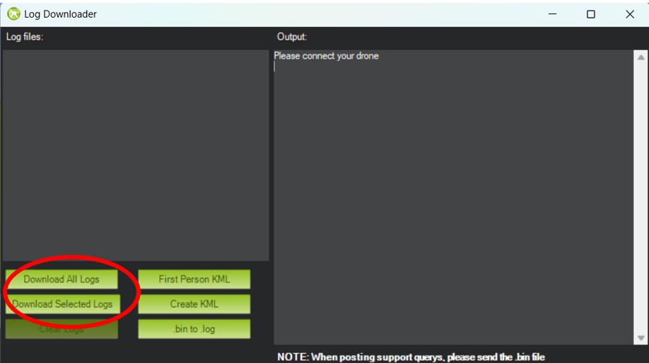

# Data Logging

## Downloading Cube logs

The flight controller automatically creates a log of all its sensors (IMUs, temp. sensors, etc.) and its attitude changes during operation into a .bin file. These are necessary to analyse the behaviour of the drone in the wind tunnel and should be downloaded after each test so that the appropriate subteams of the Company can use their data.

!!! warning "The cube must be armed in order to log data"

The data in stored in .bin files. The easiest way to access these files is pulling them directly off of the SD card.

These logs can also be accessed through Mission Planner by clicking the `Download DataFlash Log Via Mavlink` button in the `DataFlash Logs` panel.

This open up the `Log Downloader` menu, showing all avaible log files which you can download from here.

!!! warning "The download is quite slow over usb connection and extremely slow over Wifi"

!!! tip "You can also view a selected .bin file directly with the `Review a Log` button"

## Optional: Logging through LUA scripts

LUA scripts can create and modify files on the Cube’s memory; therefore, it is possible to create logs using LUA scripts (i.e. saving flap angles from the sensor into a CSV). This should only be done for a few sensors only, as it requires a lot of processing power from the flight controller. The example scripts will showcase this as well.

## MatLab data analysis

Using matlab flight add on