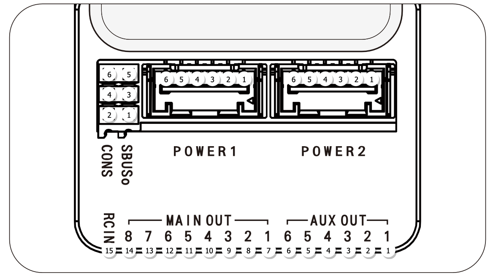
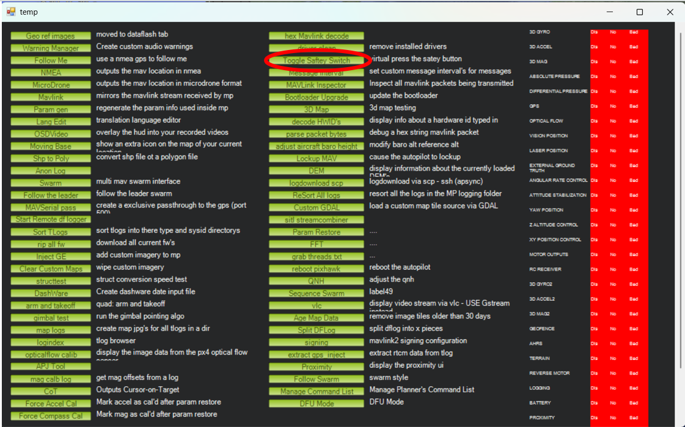
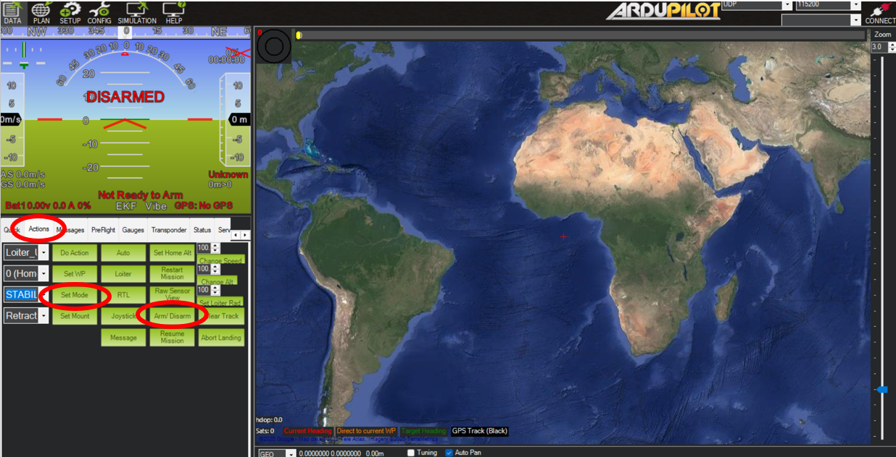
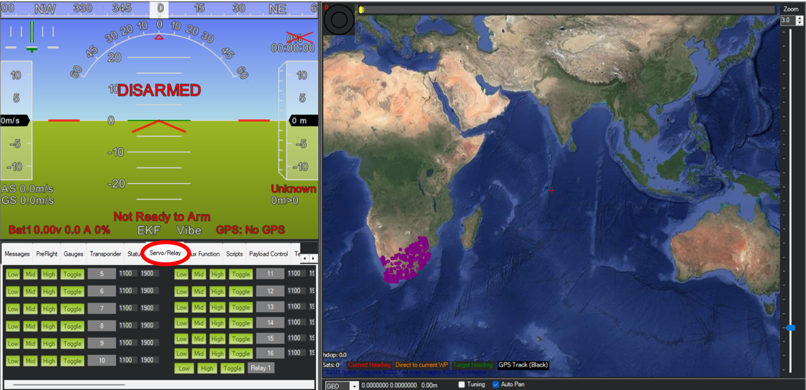

## Servo power

We'll be using servo motors to move control surfaces. These can draw significant current when 'stalled', i.e. the servo is trying to move but has reached the end of a mechanism's movement (e.g. ~1A for a [small servo](https://uk.farnell.com/dfrobot/ser0047/servo-motor-180deg-1-47n-m-6v/dp/3769943), and up to 4A for a [large one](https://uk.farnell.com/dfrobot/ser0047/servo-motor-180deg-1-47n-m-6v/dp/3769943) - click through to data sheets). Because we don't want to have to overengineer or burn out our microcontrollers and small circuitry in the flight controller, we need to provide separate power to the servo 'rails'.

The servo pins on the CubePilot are along the bottom edge of the carrier board. All of the positive (+) pins and all of the negative (-) pins are connected to one another (hence 'rail'), and the signal (S) pins provide a [standard pulse-width modulated control signal](https://en.wikipedia.org/wiki/Servo_control). Each servo channel consists of three vertical pins, and the channels are labelled with their numbers.

We'll use a Battery Elimination Circuit (BEC), so-called because it eliminates the need for separate motor/servo batteries, to provide voltage to the servo rails. Use the provided BEC, ensure it's set up to provide the correct voltage for your servos (start with 5V, some high-power servos take 7V or more), and connect its output to any of the servo channels. **taking care to ensure the correct polarity**:

* negative (-): black (or sometimes brown) wire
* positive (+): red wire
* signal (S): white or orange wire

## Connecting servos

This is where we start diverging significantly from the standard use of Ardupilot/Mission Planner/the Cube. You'll only be 'flying' your UAV assemblies in the wind tunnel, and not assembled as a full aircraft, so we will be diverging from the standard setup instructions. It's worth having a look at the [First Time Setup docs](https://ardupilot.org/plane/docs/common-basic-operation.html), but we'll only be using a subset.

Let's just get one servo moving. There are two 'types' of servo output on the Cube - 'main' are for flight control surfaces (or ESCs/motors for multirotors), and 'aux' are for auxiliary servos, e.g. to press a camera shutter, drop a payload, or release an emergency parachute.

We'll configure flight control servos later. For now, connect a servo to AUX1 and we'll move it manually using Mission Planner.

## Moving servos

We need to: 
1. virtually flip the 'safety switch' (this would be a switch on the UAV if you were flying a real vehicle)
2. 'arm' the vehicle (this would be done via a switch on the safety pilot's radio transmitter)
3. move the servo using the Mission Planner interface (this could be a pilot switch, or an automated command)

`Ctrl F` opens up some a settings menu. Click `toggle servo safety` as seen below to turn off the safety. 

In `Actions` there’s the arm button as seen below. This panel also allows you to manually set the flight mode.

The `Servo/Relay` panel allows you to manually move servos in Mission Planner.

!!! tip "Make sure safety toggle is off or you won't be able to move anything"
    You'll also need to have set up the parameters for the servo you want to move