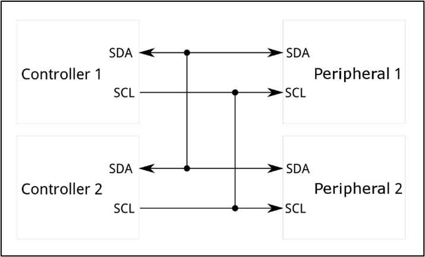

# I²C: Inter-Integrated Circuit Communication

The Cube supports I²C communication, allowing you to connect a wide range of external sensors like airspeed sensors, magnetometers, and rangefinders using a shared two-wire interface.

!!! info "I²C ("Inter-Integrated Circuit") is a two-wire communication protocol that allows multiple digital devices to communicate over a shared bus."
    It’s useful because it reduces wiring complexity and enables efficient communication between sensors, microcontrollers, and other peripherals.

If you're REALLY keen, the I²C specification can be found below, though it's not for the faint of heart (and entirely unnecessary for your work).

I2C documentation: [I2C-bus specification and user manual (nxp.com)](https://www.nxp.com/docs/en/user-guide/UM10204.pdf)

## I²C Bus Details

An I²C bus uses two data wires: SCL & SDA, which are a clock line and a data line respectively. The fact that I²C is a BUS means that many devices can be connected using the same SCL & SDA wires - each device only pays attention to transmissions that start with its unique address, and ignores everything else. Care must be taken to avoid address conflicts - every device on the I²C bus must have a different address, or the devices sharing an address will try to talk over each other, and everything will break.

The wiring of the bus itself is straightforward: connect the SCL line to the SCL pins and the SDA line to the SDA pins of all devices on the bus, as seen in Figure 1. If you're interfacing with the Cube's I²C bus, then that is it, other than connecting power to each device.

Warning if you venture beyond the Cube: if you try to use I²C with other devices such as a microcontroller, both the SDA and SCL lines will require a "pull-up resistor", placed between the lines and the power (+5V or +3.3V) line. This is because I²C is an "open-drain" protocol - to communicate over the data lines, devices actively drive the line low (for a binary 0), and then release the line, whereby the pull-up resistors return the bus to a high state (for a binary 1). Again, if using the Cube, you can ignore this section - there is no need for dedicated external pull-up resistors as there are built-in ones in the flight controller.



Mock-up of an I2C serial bus. Image credit (and a generally good resource for further learning): [SparkFun I²C Tutorials](https://learn.sparkfun.com/tutorials/i2c/all)

## Wiring into the Cube's I²C Bus Ports

To interface with the Cube's I²C buses, you will need to use a 4-pin JST-GH connector, plugged into "I2C 2" on the Cube carrier board. Please see "Expert Links -> CubePilot pinout" for details of which pin is which. The I2C 2 port, confusingly, interfaces with the Cube's I²C bus 0. The Cube also has an I²C bus 1 and I²C bus 2. This is relevant when you come to Lua scripting.

!!! tip 
    The GPS 1 port has additional I²C lines (for the I²C bus 1) if you need more than one I²C bus.
    You only need to connect PWR, GND, SCL, and SDA from within the GPS port.

## Using I²C: Lua Scripts

You will have to code a lua script file to talk to your external I²C devices. Most devices you will use, such as the DFRobot ADS1115 ADCs that you have been issued, come with a library/driver, which handles all of the low-level register reading and writing. This allows the user to more simply interface with the device. **Unfortunately for you, these are almost always only available in C/C++, mostly within the Arduino framework - NOT in lua script**. 

It is possible to port a library/driver across to lua script by reading the driver and understanding which registers need to be read in what order to communicate with the device. This is not a trivial task; we have created a lua script port of the DFRobot ADS1115 ADC that you have been issued to speed you on your way. You can use this to log data from the ADC, but it may also be helpful if you try to port your own I²C device library. The code is well commented, so you can understand how bytes are read and written to and from the I²C bus. Here are the two main commands, extracted from the ADC library port, required to communicate over I²C:

```
local ads1115 = i2c:get_device(0, ADS1115_I2C_ADDRESS)
```

This tells the Cube to connect to a device on I²C bus 0 with the address ADS1115_I2C_ADDRESS (which is a hexadecimal value assigned earlier in the code - N.B. the ADC has two values, which you can swap between with the switch on the device). The variable ads1115 is then used for future communications.

```
result = ads1115:transfer(string.char(reg), 2)
```

This tells the Cube to read 2 bytes from the ADS1115, from the register with the address in "reg". A write command works the same way, except that the first argument in the ads1115:transfer() function gives the register address, followed by the data bytes being written. The second argument is 0, as no bytes are being read:

```
    local write_data = string.char(reg, high_byte, low_byte) -- Write command: register address + 2 data bytes
    return ads1115:transfer(write_data, 0)
```

There is much more information available in the links provided, and elsewhere, on the I²C bus. Please ask questions in the sessions if you are having trouble.

## DFRobot ADS1115 ADC Example Script

The following code can be uploaded to your Cube, following the steps in "06. Lua Scripts". It will, by default, record the voltages of all 4 ADC channels, once per second for a minute. It will output them in the "Messages" tab of Mission Planner and also save them to a .csv file in the Cube's root directory, which can be downloaded after data logging is completed. This is only a minimal working example - please feel free to edit it. You might want to change the data logging rate, which channels you care about, or perhaps you want to implement a way to extract the information from Mission Planner directly over Python, forgoing the need for .csv? Or perhaps you might want to implement an input that allows you to start and stop logging when you want to?

Please ask if the code is not working for you. The code follows:

```
-- ADS1115 4-Channel ADC Logger for CubeOrange+
-- Reads voltage from all 4 channels of DFRobot ADS1115 over I2C and logs to CSV

-- ADS1115 Constants - Leave unchanged!
local ADS1115_REG_POINTER_CONVERT = 0x00
local ADS1115_REG_POINTER_CONFIG = 0x01 -- ADS1115 Register Addresses
local MUX_AIN0_GND = 0x0004  -- Channel 0
local MUX_AIN1_GND = 0x0005  -- Channel 1
local MUX_AIN2_GND = 0x0006  -- Channel 2
local MUX_AIN3_GND = 0x0007  -- Channel 3
local COMP_QUE_DISABLE = 0x0003 -- Comparator configuration
local GAIN_TWOTHIRDS = 0x0000 -- Gain configuration (eGAIN_TWOTHIRDS = 0, gives ±6.144V range, 1 bit = 0.1875mV)
local GAIN_COEFFICIENT = 0.1875  -- mV per bit for GAIN_TWOTHIRDS (for 0-6V signals)
local MODE_SINGLE = 0x0001  -- Single-shot mode configuration

-- Logging Code Configuration - Change with care!
local ADS1115_I2C_ADDRESS = 0x48  -- Default address (can be 0x49 dependent on ADC switch position)
local RATE_128 = 0x0004 -- Rate configuration (128 SPS)
local ADS1115_CONVERSION_DELAY_MS = 10  -- Conversion time at 128 SPS is ~8ms, using 10ms for safety
local READINGS_COUNT = 60  -- Number of readings to log
local LOOP_DELAY_MS = 1000  -- Delay between readings in milliseconds
local file_name = "ads1115_voltage_log.csv" -- Logging file name

-- Code variable initialisations - Leave unchanged!
local file
local voltage_readings = {}
local count = 0
local current_channel = 0
local channel_configured = false
local conversion_start_time = 0
local ads1115 = i2c:get_device(0, ADS1115_I2C_ADDRESS) -- I2C bus initialization
ads1115:set_retries(10)

-- Code function definitions - leave unchanged!
local function write_ads_register(reg, value)
    local high_byte = (value >> 8) & 0xFF
    local low_byte = value & 0xFF
    local write_data = string.char(reg, high_byte, low_byte) -- Write command: register address + 2 data bytes
    return ads1115:transfer(write_data, 0)
end -- Writes 16-bit value to ADS1115 register
local function read_ads_register(reg)
    local result = ads1115:transfer(string.char(reg), 2)
    if not result then
        return nil
    end -- Writes register address and read 2 bytes in one transaction
    local value = (result:byte(1) << 8) | result:byte(2) -- Converts two bytes to 16-bit signed integer
    if value > 32767 then
        value = value - 65536
    end -- Converts to signed int16
    return value
end -- Reads 16-bit value from ADS1115 register
local function configure_channel(channel)
    local mux_config
    if channel == 0 then
        mux_config = MUX_AIN0_GND
    elseif channel == 1 then
        mux_config = MUX_AIN1_GND
    elseif channel == 2 then
        mux_config = MUX_AIN2_GND
    elseif channel == 3 then
        mux_config = MUX_AIN3_GND
    else
        return false
    end
    local config = 0x8000 |  -- Start single conversion (OS bit)
                   (mux_config << 12) |  -- Multiplexer
                   (GAIN_TWOTHIRDS << 9) |  -- Gain: ±6.144V range (for 0-5V+ signals)
                   (MODE_SINGLE << 8) |  -- Single-shot mode
                   (RATE_128 << 5) |  -- 128 SPS
                   COMP_QUE_DISABLE  -- Disable comparator
    return write_ads_register(ADS1115_REG_POINTER_CONFIG, config)
end -- Configures ADS1115 for specific channel
local function check_ads1115()
    local result = read_ads_register(ADS1115_REG_POINTER_CONFIG) -- Attempts to read the config register
    return result ~= nil
end -- Checks if ADS1115 is connected
local function write_to_file()
    if not file then
        error("Could not open file")
    end
    file:write(string.format("%u, %.2f, %.2f, %.2f, %.2f\n", 
               millis():toint(), 
               voltage_readings[1] or 0, 
               voltage_readings[2] or 0, 
               voltage_readings[3] or 0, 
               voltage_readings[4] or 0))
    file:flush()
end -- Writes data to file

-- Main Code Execution - Leave unchanged!
if not check_ads1115() then
    gcs:send_text(0, "ADS1115 not detected on I2C bus!")
    error("ADS1115 not detected")
end -- Initialises ADS1115
gcs:send_text(0, "ADS1115 detected successfully")

file = io.open(file_name, "a")
if not file then
    error("Could not create file")
end -- Opens file for logging

file:write('Time [ms], CH0 [mV], CH1 [mV], CH2 [mV], CH3 [mV]\n')
file:flush() -- Writes CSV header
gcs:send_text(0, "CSV file created: " .. file_name)

function update()
    if not channel_configured then
        if not configure_channel(current_channel) then
            gcs:send_text(0, string.format("Failed to configure channel %d", current_channel))
            voltage_readings[current_channel + 1] = 0
        else -- Configures the current channel
            channel_configured = true
            conversion_start_time = millis()
        end
        return update, 10 -- Reschedules quickly to read the result
    else
        if millis() - conversion_start_time >= ADS1115_CONVERSION_DELAY_MS then -- Do this if enough time has passed for conversion
            local raw_value = read_ads_register(ADS1115_REG_POINTER_CONVERT)
            if raw_value then
                voltage_readings[current_channel + 1] = raw_value * GAIN_COEFFICIENT
            else
                voltage_readings[current_channel + 1] = 0
            end -- Reads voltage or sets to 0 on error
            channel_configured = false
            current_channel = current_channel + 1
            if current_channel >= 4 then -- Do this if all 4 channels have been read
                gcs:send_text(0, string.format("ADC: %.0f, %.0f, %.0f, %.0f mV", 
                              voltage_readings[1] or 0,
                              voltage_readings[2] or 0,
                              voltage_readings[3] or 0,
                              voltage_readings[4] or 0)) -- Outputs to GCS
                write_to_file() -- Writes to file
                count = count + 1 -- Increments counter
                if count >= READINGS_COUNT then
                    file:close()
                    gcs:send_text(0, "Logging complete. File closed.")
                    return
                end -- Stops logging after set number of readings
                current_channel = 0 -- Resets for next cycle
                return update, LOOP_DELAY_MS -- Reschedules with full loop delay
            else
                return update, 10 -- Continues reading next channel
            end
        else
            return update, 10 -- Waits a bit more for conversion
        end
    end
end -- Main update loop

return update() -- Starts the update loop
```
