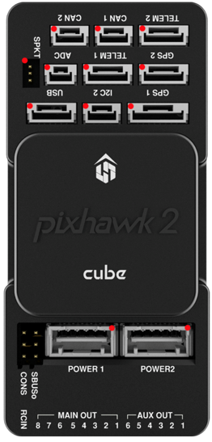
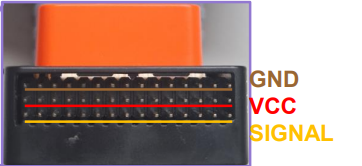

# Cube Information

The Cube Orange+ is a high-performance open-source flight controller designed for professional UAVs and robotics.
It simplifies integration with ArduPilot, featuring built-in telemetry ports and onboard SD card logging for mission data.

!!! info "You will have the unique opportunity to play with one as the Cube will act as your main flight computer."

Image Credit: Ardupilot

!!! warning "The cube is a very expensive research grade flight computer so please don’t blow it up"
    
    Always use the buzzer adapter when connecting over USB and the stop button when using the power source.  

    Never plug directly into USB.  

    Unplug if you see voltage/current spikes or if the buzzer starts making noise.  
    
    If you see blue smoke, it's too late.

[Cube User Manual (cubepilot.org)](https://docs.cubepilot.org/user-guides/autopilot/the-cube-user-manual)

[Servo Movement documentation (ardupilot.org)](https://ardupilot.org/dev/docs/mavlink-move-servo.html)

[MAVLink common messages (mavlink.io)](https://mavlink.io/en/messages/common.html)

## Requirements

Year on year the requirements may vary but the basic bits stay the same. Make sure the check the Design Specification and Deliverables documents for specifics.

The student-built avionics should be able to:

- Move the control surfaces
- Talk to the cube via Wifi
- Talk to the cube via Radio
- Log the generated data
- Sense flap angle
- Sense pressure
- Switch between cube modes and arming states

## Cube Setup

|   Port       | What to plug in |
|--------------|-----------------|
| Power 1      | Power plug      |
| USB          | USB dongle      |
| Telem 1      | Wifi chip       |
| RC in        | RC transmitter  |
| AUX OUT 1    | Power pin       |
| MAIN OUT 1-8 | Servo pins      |
| I2C 2        | I2C sensor      |

Add image of full system.