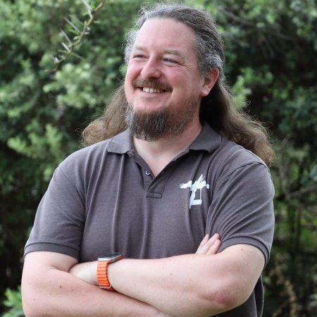
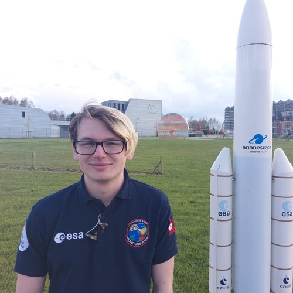
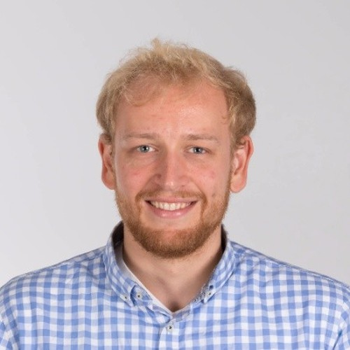
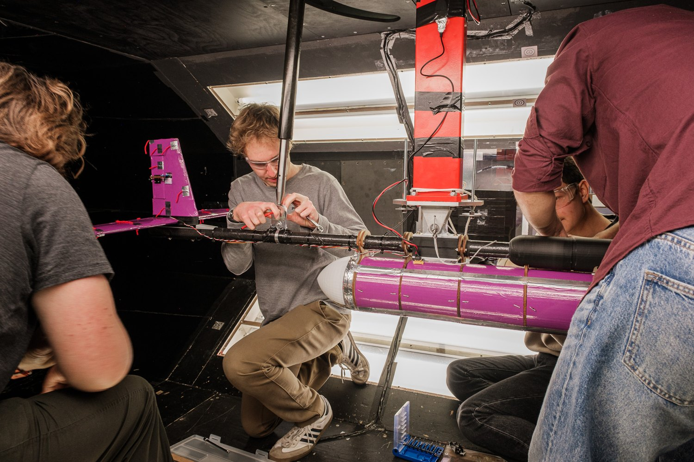
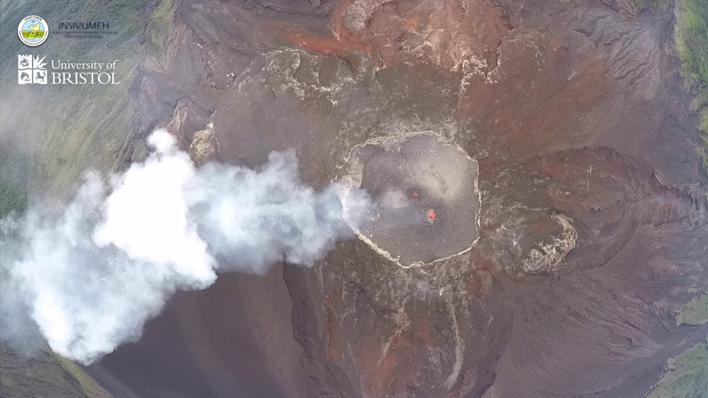
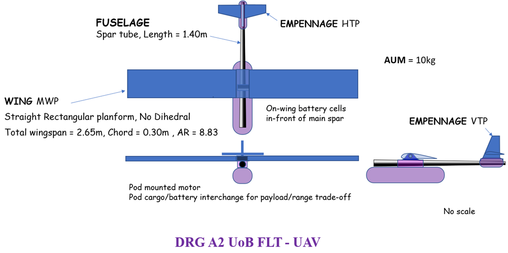
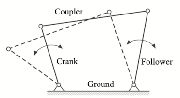
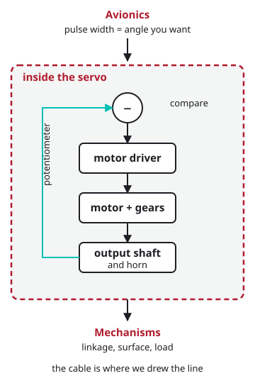
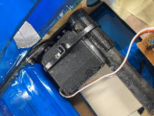

<!-- _class: title -->

# Avionics & Mechanisms

## AVDASI 2 · Introduction

Dr. Steve Bullock

<!--
Full cohort, 1.40 Pugsley, 12:00-13:00.

HARD STOP 12:50. FDAC control lecture 1 is 13:00-15:00 in this room, and the
TSRs set the Quanser rig up during this hour. 25 minutes each half.

(That FDAC slot is two 50-minute lectures with a break, not one 110-minute
block, so if the rig setup needs longer there is a second break inside it to
borrow from. Steve's call, and not a reason to plan on overrunning here.)

Top-level bullets are fragmented - they appear one at a time on a click.
-->

---

# Today

**Who we are, and where things happen**

**Part 1 — Avionics**
What it does in your aircraft · what the requirements ask for · integration · the workshops, and how to get ready

**Part 2 — Mechanisms**
What has to move · the design task · where it meets avionics · the sessions

---

# Who's who

**Steve Bullock**
Avionics
Mechanisms

**George Burns**
Avionics

**Tim Ward**
Avionics

**Mark Graham**
Mechanisms

**Vince Maes**
Mechanisms

<!--
CHECK BEFORE TUESDAY: the four supplied photographs were assigned in the order
they were sent - Burns, Ward, Graham, Maes. Swap the files in
docs/assets/people/ if any of them is wrong.

Robin Carter starts his PhD on 1 Oct and has flown these autopilots on the MSc
Aerial Robotics project; mention him if useful.
-->

---

# Where things happen

| Space | Room | What for |
|---|---|---|
| **Stack Room** | [QB F.05](https://use.mazemap.com/#v=1&config=UoBCampuses&view_access_token=fcab572c2d2a4e479089433ce060d24b&search=F.05) | Avionics workshops, Friday mornings |
| **Avionics lab** | [QB M.003](https://use.mazemap.com/#v=1&config=UoBCampuses&view_access_token=fcab572c2d2a4e479089433ce060d24b&search=M.003) | Kit issue and return, supervised tool use |
| **Design Suite** | [QB 1.59](https://use.mazemap.com/#v=1&config=UoBCampuses&view_access_token=fcab572c2d2a4e479089433ce060d24b&search=1.59) | Mechanisms sessions, Thursdays |
| **The Hangar** | [L.080](https://use.mazemap.com/#v=1&config=UoBCampuses&view_access_token=fcab572c2d2a4e479089433ce060d24b&search=L.080) | Main lab, open access |
| **This room** | [1.40 Pugsley](https://use.mazemap.com/#v=1&config=UoBCampuses&view_access_token=fcab572c2d2a4e479089433ce060d24b&search=1.40%20Pugsley) | Today |

Room numbers link to the map. All in the Queen's Building except the Hangar.

<!--
Room links open a MazeMap search for that room number, using the campus
collection link with its access token - the same link Steve uses, which finds
rooms the public API does not.
-->

---

# The model is only as good as what moves it

Last year's fuselage in the 7×5 tunnel

Photos: Ross Dewar

* Your model has **control surfaces**, and something has to move them repeatably
* Your test campaign needs **data** — measured, time-stamped, logged
* Your aerodynamicists need **the angle you asked for**, not the one you got
* Avionics and mechanisms turn foam and carbon into an **instrumented test article**

---

# Flight-grade kit, off-design

<iframe src="https://www.youtube-nocookie.com/embed/N57M-9iFxZ8?start=23&mute=1&rel=0&modestbranding=1&cc_load_policy=0&iv_load_policy=3" allow="autoplay; encrypted-media; fullscreen" allowfullscreen></iframe>

<!--
Video starts at 23s, muted. In the PDF this is a still image linked to the
video, because Marp's PDF export cannot carry an iframe.

The Cube Orange+ runs ArduPilot and is the Flight Lab's standard research
autopilot - flown for volcano monitoring, conservation and search and rescue.
In AVDASI 2 it is bolted into a wind tunnel with no GPS, and you command
surfaces directly. That is deliberately off-design: much of the avionics work
is getting a flight controller to behave usefully on the ground.
-->

---

# What the spec asks of avionics

> "Aircraft control systems **shall** comprise a flight control system (FCS), radio control system (RCS), telemetry system (TMS), and ground control station (GCS), with associated power, wiring harnesses, antennae etc."

**Provided to you**

* The flight controller
* The radio control system
* The telemetry system
* Servos, from a set list

**Yours to design**

* Power distribution and harnesses
* Mounting and installation
* Logging, calibration, evidence
* Everything that connects them

<!--
Requirements Spec section 2.2, Electronics. Point at the word "shall": this is
a customer document, not advice. Almost none of the hardware is a choice, and
almost all of the engineering is in what joins it together.
-->

---

# What it has to do

* Every surface — elevator, rudder, aileron, flap — **commandable from both the radio and the telemetry link**, to specific angles
* **PID stability augmentation** in pitch, tuned on the provided flight controller, switchable on and off
* **Log flight data: 5 Hz minimum, 20 Hz preferred** — pitch angle and rate, servo demand, and whatever else your Company needs
* Everything **removable**, fixed with mechanical fasteners, for maintenance and recycling
* **Nothing above 15 V**, anywhere on or connected to the aircraft

<!--
Sections 2.2, 2.3, 2.4, 3.3 and 4.4. The logging rate is the one students
underestimate: it rules out the slow-and-simple approaches.
-->

---

# What "done" looks like — for now

> "A bench-top prototype of full FCS, RCS, TMS, GCS, and associated systems **shall be demonstrated working** at Gate 2a."

* The **step-by-step guide** takes you there: kit, autopilot, telemetry, power, servos, sensors, logging
* Mechanism prototypes are demonstrated with **servo testers**, not the flight controller
* **This is done for this teaching block only — integration comes next.** A bench that works is not an aircraft that works

<!--
Section 2.2 for the gate, 2.3 and 2.4 for the servo-tester route. Say plainly
that TB1 ends with two halves that each work on a bench, and that putting them
together is the harder job which starts in TB2 - that is the thing groups
leave too late.
-->

---

# Avionics is an integration job

| With | You need to agree |
|---|---|
| **Aerodynamics** | Surface sizes and deflections, and so hinge moments, and so servo torque |
| **Mechanisms** | Where the boundary sits: they own torque, servo choice and kinematics; **you supply the PWM** |
| **Structures** | Mounting, access, cable routes, mass |
| **Test** | Power, comms, what's logged, how it's handed over |

* This table is a **starting point, not the answer** — read the spec for your own remit, then **agree each interface** with the division on the other side
* Interfaces agreed late are the ones that fail

---

# Interfaces to pin down early

* **Torque and travel**: what the surface needs, and what the servo gives with margin when it is **stalled — servo stall, not aerodynamic stall**
* **Power**: what each component draws, at what voltage, from which supply
* **Connectors and cables**: which plug, which route, and who crimps it
* **Data**: what's logged, at what rate, in what units, and who uses it
* **Command**: who moves which surface in the tunnel, and how you stop it
* Most of these depend on **other teams' work that hasn't happened yet**. Start with a rough number — theirs, or your own gut — and **track what has to be firmed up, and by when**

<!--
Servo stall means the servo is driving against a stop or a jam and drawing its
maximum current - amps, from a rail sized for milliamps. Nothing to do with the
wing stalling, and the double meaning catches people every year.
-->

---

# The system on the bench

<!--
TODO(Steve): a single system diagram would be better than two lists. The
wiring photograph from the bench test would serve, once it exists.
-->

---

# Avionics workshops

| Week | When | Where | Focus |
|---|---|---|---|
| **1** | **Friday, 09:00–11:00** | Stack Room + M.003 | Kit issue; Cube, Mission Planner, telemetry, power |
| 2 | Friday, 09:00–11:00 | Stack Room | Servos and Lua scripting |
| 4 | Friday, 09:00–11:00 | Stack Room | Sensors: ADC and I²C |
| 5 | Friday, 09:00–11:00 | Stack Room | To be confirmed |

No session in week 3 — Company Day. Check SharePoint for any changes.

---

# Friday: kit day

1. **09:00** A short taught intro in the Stack Room: the kit, and the requirements in more depth
2. **From 09:30** Groups go up to **M.003**, one at a time, to collect a kit
3. **While you wait** Read the guide's first pages (*Kit*, *Cube*), with no hardware yet
4. **Kit in hand** Work through the guide to the Friday checkpoint
5. **To finish** How not to break each component

**Friday checkpoint:** Cube on Plane firmware, buzzer quiet, connected over Wi-Fi, running on bench power.

---

# Getting ready

* **Install Mission Planner on a Windows laptop** before Friday — one working laptop per group
* **Bring** that laptop, charged
* **Read** the guide's index, *Kit* and *Cube* pages

* Everything you need: **[avdasi2.github.io](https://avdasi2.github.io)** → Avionics → Getting ready
* The Cube setup, scripts and guidance are **being revised this month** — a more robust version is coming, with a one-step settings file

---

<!-- _class: section -->

# Part 2: Mechanisms

## From servo to surface

<!--
Handover point. Steve on theory and design tools; Mark and Vince on
implementation. Sessions start in week 3.
-->

---

# What mechanisms have to deliver

Every moving surface needs a mechanism designed, built and proved:

* **Flap** — plain, slotted or Fowler, 0° to 30°
* **Aileron**, **elevator**, **rudder** — four-bar linkages, ±40° to ±45°
* **Leading edge device** — droop or slat, starboard wing
* **Landing gear** — deployable, behind a door

* Each holds its angle **under aerodynamic load**, to a stated tolerance, within a stated time

<!--
Drawing is DRG A2 from the requirements spec. Tolerances: 2 degrees for
elevator and rudder, 5 for flap and aileron.
-->

---

# The design task

Crank, coupler, follower, ground

The same thing in the Linkage app

* **Kinematics**: four-bar linkages, mobility, function generation
* Drawn and checked in the **Linkage app**

* **Then the real world**: bearings, slop, backlash, friction
* Materials, failure modes, and taking it apart again

---

# Where mechanisms meets avionics

**The boundary is the servo cable.**

* **Mechanisms own** torque, servo selection, kinematics, implementation — and **sensor integration**
* **Avionics own** the PWM signal, servo rail power, commanding angles, logging
* **Sensor selection is joint**: readable as well as mountable

* Proved with a **servo tester** first — HJ, Parallax or the blue micro servos — then integrated

<!--
TODO(Steve): photographs of the three servos and a servo tester would carry
this slide. Drop them in docs/assets/intro/ as servo-hj.jpg, servo-parallax.jpg,
servo-micro.jpg and servo-tester.jpg and they can go straight on.
-->

<!--
Worth saying out loud: a hobby servo is itself electromechanical, with its own
closed loop inside - a potentiometer on the output shaft, compared against the
commanded pulse width, driving the motor until the error is zero. So the real
interface arguably sits *inside* the servo, and the cable is just where we
agreed to draw the line. Every interface is a choice like that.
-->

---

# Learn from what broke last year

Actuator cable-tied **and glued** to the false rear spar

Weak linkages, **no washers**, nothing to reduce friction

**Threaded rod** as a pivot, into an oversize hole and into the foam — and impossible to take apart

* Start simple, prototype early, design for disassembly

---

# Mechanisms sessions

| Week | When | Where |
|---|---|---|
| 3 | Thu, 11:00–13:00 | [1.59 Design Suite](https://use.mazemap.com/#v=1&config=UoBCampuses&view_access_token=fcab572c2d2a4e479089433ce060d24b&search=1.59) |
| 4 | Thu, 11:00–13:00 | [1.59 Design Suite](https://use.mazemap.com/#v=1&config=UoBCampuses&view_access_token=fcab572c2d2a4e479089433ce060d24b&search=1.59) |
| 5 | Thu, 11:00–13:00 | [1.59 Design Suite](https://use.mazemap.com/#v=1&config=UoBCampuses&view_access_token=fcab572c2d2a4e479089433ce060d24b&search=1.59) |

Install the **[Linkage app](https://blog.rectorsquid.com/linkage-mechanism-designer-and-simulator/)** before week 3 — **Windows only**; the macOS version is in early beta.

<!--
TODO(Steve): session content and who leads each - to be confirmed with Mark
and Vince.
-->

---

<!-- _class: title-inverted -->

# Questions

## Avionics: Friday, 09:00, Stack Room

Mechanisms: week 3
